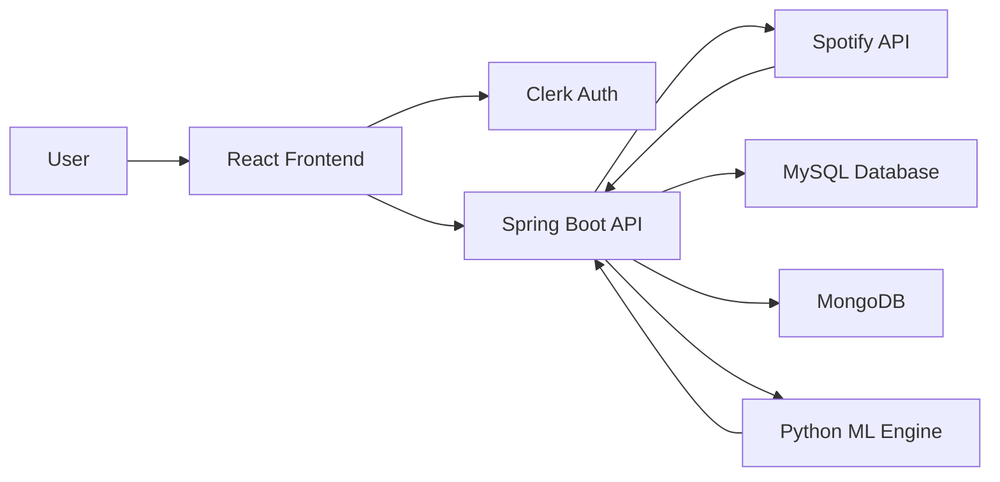

# 🎵 Recommender-Pro

<div align="center">


**A full-stack music exploration platform that leverages machine learning to provide personalized song recommendations**

[](https://react.dev/)
[](https://spring.io/projects/spring-boot)
[](https://www.python.org/)
[](https://www.mysql.com/)
[](https://www.mongodb.com/)

</div>

---

## 📖 Overview

**Recommender-Pro** is a full-stack music exploration platform that leverages machine learning to provide personalized song recommendations. By integrating with the Spotify API, it allows users to discover new music based on their existing library and preferences.

---

## 🎬 Platform Demo

### 🔐 Spotify Authentication Flow

*Secure OAuth 2.0 login flow with automatic token management*

### 🎯 Personalized Recommendations

*ML-powered recommendations based on your listening history and preferences*

### 🎵 Music Player & Library

*Intuitive music player with real-time library synchronization*

---

## 🚀 Tech Stack

### Frontend

| Technology | Version | Purpose |
|------------|---------|---------|
| **React** | v19 | Built with the latest React features for a responsive UI |
| **Clerk** | Latest | Used for secure user authentication and identity management |
| **Lucide React & React Icons** | Latest | For a modern, intuitive iconography system |
| **React Router DOM** | v6 | For seamless client-side navigation |

### Backend

| Technology | Version | Purpose |
|------------|---------|---------|
| **Spring Boot** | v3.4.2 | High-performance Java framework for the REST API |
| **Spring Security** | Latest | Protects API endpoints and manages session security |
| **MySQL** | Latest | Relational data storage via JPA |
| **MongoDB** | Latest | Flexible document storage for user preferences |
| **Python** | 3.x | ML Engine - dedicated script for recommendation logic using data science libraries |

---

## 📁 Project Structure

```
recommender-pro/
│
├── frontend/              # React application
│   ├── components/        # Dashboard, player components, and recommendation carousels
│   ├── services/          # API integration services
│   ├── hooks/             # Custom React hooks
│   └── utils/             # Helper utilities
│
└── backend/               # Spring Boot project
    ├── controllers/       # API controllers
    ├── services/          # Business logic layer
    └── repositories/      # Data access layer
```

**`/frontend`**: React application containing the dashboard, player components, and recommendation carousels.

**`/backend`**: Spring Boot project containing the API controllers, services, and repository layers.

---

## 🛠 Major Functions & Features

### 1️⃣ Advanced Spotify API Integration


The platform serves as a sophisticated bridge to the Spotify ecosystem, managing complex authentication flows.

#### Key Features:

- **OAuth 2.0 Authentication**: Implements a secure "Authorization Code" flow, allowing users to grant the app specific permissions to interact with their Spotify data.

- **Automated Token Lifecycle**: The `SpotifyApiClient` service automatically handles the initial exchange of authorization codes for access tokens.

- **Seamless Refresh Mechanism**: To prevent session interruptions, the backend includes a dedicated `refreshSpotifyAccessToken` function that uses refresh tokens to generate new access tokens without requiring user re-login.

- **Centralized Configuration**: All API credentials (Client ID, Secret, and Redirect URIs) are managed via Spring `@Value` annotations for secure and flexible deployment.

```java
@Service
public class SpotifyApiClient {
    @Value("${spotify.client.id}")
    private String clientId;
    
    @Value("${spotify.client.secret}")
    private String clientSecret;
    
    // Automated token management
    public TokenResponse refreshSpotifyAccessToken(String refreshToken) {
        // Seamless token refresh logic
    }
}
```

---

### 2️⃣ User Library & Personalized Content Management


Users have full control over their musical data through a dedicated management layer.

#### Key Features:

- **Dynamic Seed Generation**: The `RecommendationController` features a `random-seed` endpoint that pulls a random track from the user's existing history to act as a "seed" for new discovery sessions.

- **Liked Songs Service**: A specialized service layer facilitates the tracking and retrieval of a user's favorite tracks, which the recommendation engine then uses to build a personal taste profile.

- **Playlist Interaction**: Users can create and manage playlists, with the backend handling the association between users, playlists, and specific track URIs.

```java
@RestController
@RequestMapping("/api/recommendations")
public class RecommendationController {
    
    @GetMapping("/random-seed")
    public ResponseEntity<Track> getRandomSeed(@RequestParam String userId) {
        // Dynamic seed generation from user history
        return ResponseEntity.ok(recommendationService.generateRandomSeed(userId));
    }
}
```

---

### 3️⃣ Security and User Sync


The application prioritizes data integrity and secure access through modern authentication providers.

#### Key Features:

- **Clerk Identity Management**: Uses Clerk for frontend authentication, providing a secure and polished login/signup experience.

- **Real-time Data Synchronization**: A `ClerkWebhookController` in the backend acts as a listener for Clerk events, ensuring that when a user updates their profile or signs up, the project's internal database stays perfectly in sync.

- **Protected API Endpoints**: Spring Security is utilized to ensure that sensitive recommendation and library data are only accessible to authenticated users.

```java
@RestController
@RequestMapping("/api/clerk-webhook")
public class ClerkWebhookController {
    
    @PostMapping
    public ResponseEntity<Void> handleWebhook(@RequestBody ClerkWebhookEvent event) {
        // Real-time sync with Clerk authentication events
        userService.syncUserData(event);
        return ResponseEntity.ok().build();
    }
}
```

---

## 🚀 Getting Started

### Prerequisites

```bash
# Required
- Node.js (v18+)
- Java (v17+)
- Python (v3.9+)
- MySQL (v8.0+)
- MongoDB (v6.0+)
```

### Installation

1. **Clone the repository**
   ```bash
   git clone https://github.com/yourusername/recommender-pro.git
   cd recommender-pro
   ```

2. **Backend Setup**
   ```bash
   cd backend
   ./mvnw clean install
   ./mvnw spring-boot:run
   ```

3. **Frontend Setup**
   ```bash
   cd frontend
   npm install
   npm run dev
   ```

4. **Configure Environment Variables**
   
   Create `.env` files with your Spotify API credentials and database connections:
   ```properties
   SPOTIFY_CLIENT_ID=your_client_id
   SPOTIFY_CLIENT_SECRET=your_client_secret
   CLERK_SECRET_KEY=your_clerk_secret
   DATABASE_URL=your_database_url
   ```

---

## 🎯 How It Works



1. **User authenticates** via Clerk (frontend)
2. **Frontend requests** personalized recommendations
3. **Spring Boot API** fetches user's Spotify data
4. **Python ML Engine** processes listening history
5. **Recommendations generated** and returned to user
6. **Real-time sync** keeps library up-to-date

---

## 📊 Key API Endpoints

| Method | Endpoint | Description |
|--------|----------|-------------|
| `GET` | `/api/spotify/auth` | Initiate Spotify OAuth flow |
| `GET` | `/api/spotify/callback` | Handle OAuth callback |
| `POST` | `/api/spotify/refresh-token` | Refresh access token |
| `GET` | `/api/recommendations/random-seed` | Get random seed track |
| `GET` | `/api/recommendations/discover` | Get personalized recommendations |
| `GET` | `/api/library/liked-songs` | Fetch user's liked songs |
| `POST` | `/api/library/playlists` | Create new playlist |
| `POST` | `/api/clerk-webhook` | Sync user data from Clerk |

---

## 🎨 Screenshots

<details>
<summary><b>View More Screenshots</b></summary>

### Dashboard


### Recommendation Carousel


### Playlist Manager


</details>

---

## 🤝 Contributing

Contributions, issues, and feature requests are welcome!

1. Fork the Project
2. Create your Feature Branch (`git checkout -b feature/AmazingFeature`)
3. Commit your Changes (`git commit -m 'Add some AmazingFeature'`)
4. Push to the Branch (`git push origin feature/AmazingFeature`)
5. Open a Pull Request

---

## 📝 License

This project is licensed under the MIT License - see the [LICENSE](LICENSE) file for details.

---

## 👨‍💻 Author

**Your Name**

- GitHub: [@yourusername](https://github.com/yourusername)
- LinkedIn: [Your LinkedIn](https://linkedin.com/in/yourprofile)

---

## 🙏 Acknowledgments

- [Spotify Web API](https://developer.spotify.com/documentation/web-api/) for music data
- [Clerk](https://clerk.dev/) for authentication infrastructure
- [Spring Boot](https://spring.io/projects/spring-boot) for robust backend framework
- [React](https://react.dev/) for powerful frontend capabilities

---

<div align="center">

**⭐ If you found this project helpful, please consider giving it a star!**

Made with ❤️ and ☕

</div>
